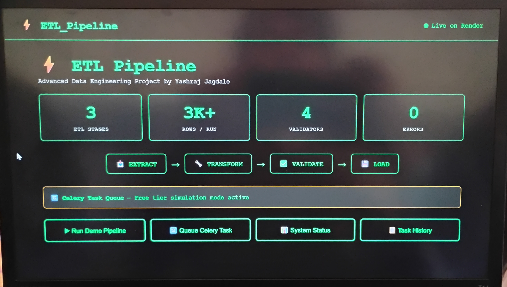
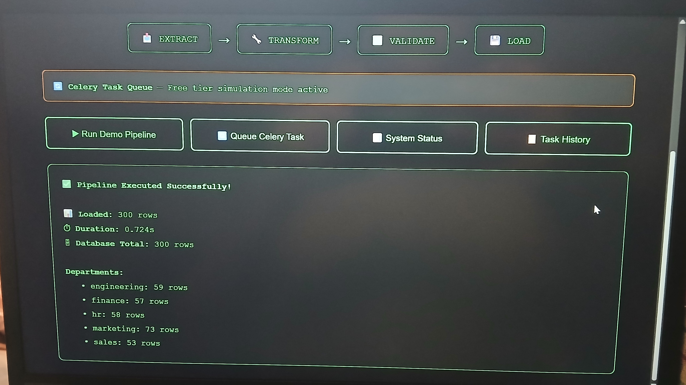
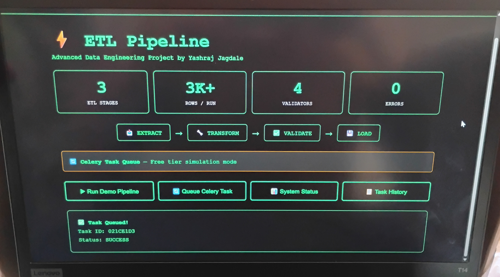
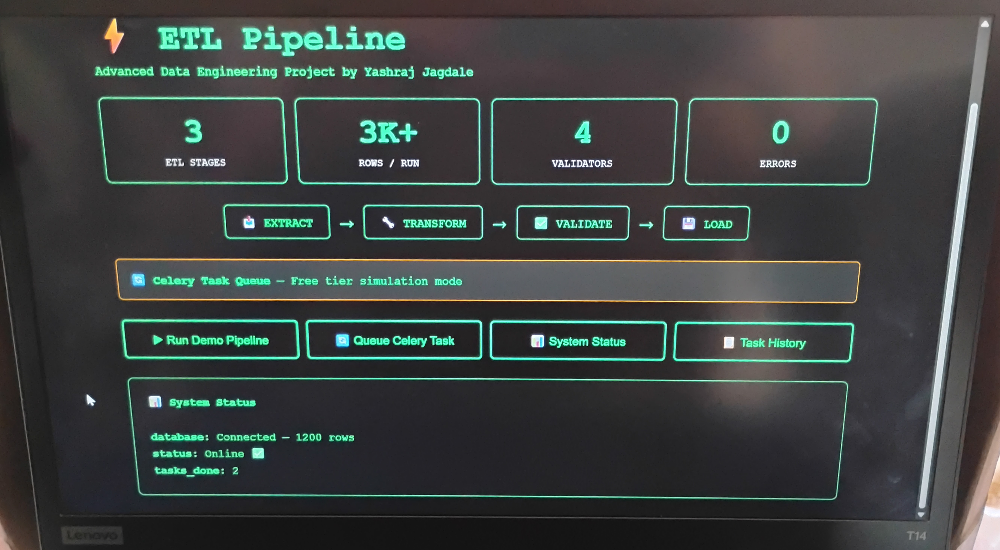
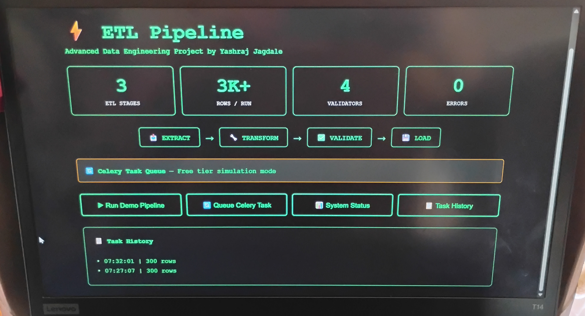

# ⚡ Automated Data Pipeline & ETL System
Extract, transform, and load large datasets automatically.


**Advanced Automated Data Pipeline & ETL System**

A robust, production-ready Extract, Transform, Load (ETL) pipeline built with Python that handles data from multiple sources with cleaning, validation, monitoring, and scheduling capabilities.

🖼 Screenshots

 - ETL_Pipeline_Dashboard 
 - Run_Demo_Pipeline 
 - Queue_Celery_Task 
 - System_Status 
 - Task_History 


### 🌐 Live Demo

**Live Project:** [etl-pipeline-1xrp.onrender.com](https://etl-pipeline-1xrp.onrender.com)

---

## ✨ Features

- **Multi-source Data Extraction** — CSV, API, Demo data
- **Advanced Data Transformation** — Cleaning, outlier handling, feature engineering
- **Data Quality Validation** — Rule-based validation with strict/warning modes
- **Database Loading** — PostgreSQL + SQLite support with upsert capability
- **Batch Processing** — Memory-efficient chunked processing
- **Scheduling & Monitoring** — Celery task queue + real-time metrics
- **Beautiful Web Dashboard** — Real-time pipeline execution UI

---

## 🛠 Tech Stack

| Category             | Technologies                      |
|----------------------|-----------------------------------|
| **Language**         | Python 3.11                       |
| **Data Processing**  | Pandas, NumPy                     |
| **Web Framework**    | Flask                             |
| **Task Queue**       | Celery                            |
| **Database**         | PostgreSQL (Primary), SQLite (Dev)|
| **ORM**              | SQLAlchemy                        |
| **Visualization**    | Rich, Custom Dashboard            |
| **Others**           | Faker, Loguru, Requests           |

---

## 📌 Core Concepts

- **ETL Pipelines** (Extract → Transform → Load)
- **Data Validation & Quality Assurance**
- **Batch Processing & Chunking**
- **Scheduling & Automation**
- **Error Handling & Retry Logic**
- **System Monitoring & Observability**
- **Idempotency & Incremental Loading**

---

## 🚀 Engineering Value

- **Data Engineering** — Real-world ETL best practices
- **System Automation** — Fully automated scheduled pipelines
- **Production Readiness** — Logging, monitoring, error recovery
- **Scalability** — Chunked processing for large datasets
- **Clean Architecture** — Modular, maintainable codebase

---

## 📁 Project Structure
    ```bash
  etl_pipeline/
  ├── main.py                    # Entry point & CLI commands
  ├── pipeline.py                # Core ETL orchestrator
  ├── config/
  │   └── settings.py            # Configuration & environment variables
  ├── extractors/
  │   ├── base_extractor.py
  │   ├── csv_extractor.py
  │   └── api_extractor.py
  ├── transformers/
  │   └── data_transformer.py    # Data cleaning & feature engineering
  ├── validators/
  │   └── data_validator.py      # Quality checks
  ├── loaders/
  │   └── database_loader.py     # Database operations
  ├── schedulers/
  │   └── pipeline_scheduler.py  # Scheduling logic
  ├── monitoring/
  │   └── logger.py              # Metrics & logging
  ├── tests/                     # Unit & integration tests
  ├── data/
  │   └── raw/                   # Input data
  ├── logs/                      # Logs & failed records
  ├── requirements.txt
  ├── .env.example
  └── README.md


🏃 How to Run Locally

  1. Clone the repository
    Bash
    git clone https://github.com/yashraj022381/ETL_Pipeline.git
    cd ETL_Pipeline

  2. Install dependencies
    Bash
    pip install -r requirements.txt

  3. Setup environment
    Bash
    cp .env.example .env
    # Edit .env with your database credentials

  4. Run the pipeline
    Bash
  - # Generate sample data
    python main.py generate
     
    # Run full pipeline
    python main.py demo

    # Run from CSV
    python main.py csv

    # Start web dashboard
    python app.py

📋 Available Commands

   - python main.py demo → Run with fake data
   - python main.py csv → Run from CSV file
   - python main.py api → Run from REST API
   - python main.py schedule → Start scheduler
python main.py generate → Create sample dataset
